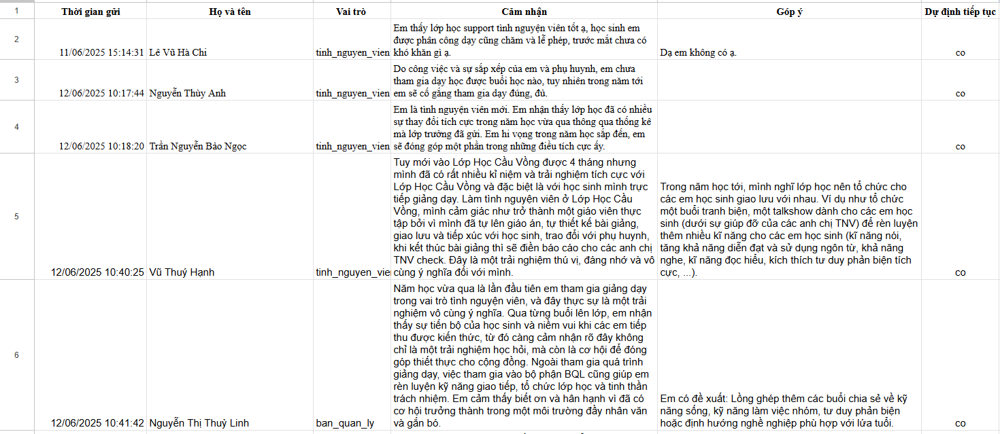

# The Rainbow Class Project

	

## Overview

**The Rainbow Class** is a volunteer management and reporting platform for a non-profit organization in Vietnam, dedicated to supporting underprivileged children who lack access to quality education. The project aims to connect volunteers, students, and parents, track progress, and foster a caring, transparent, and effective learning environment.

## Mission

Our mission is to bridge the educational gap for disadvantaged children, especially those affected by poverty, homelessness, or domestic violence, by providing free tutoring, mentorship, and emotional support.

## Key Features

- **Volunteer Management:** Track volunteer activities, attendance, and reports.
- **Student Progress Tracking:** Monitor academic achievements and improvements over time.
- **Parent & Community Engagement:** Facilitate communication between parents, students, and volunteers.
- **Automated Reporting:** Integrated with Google Sheets for real-time data collection and analysis.
- **Visual Analytics:** Performance charts and statistics for transparent evaluation.

## Technology Stack

- **Frontend:** HTML, CSS, JavaScript (Chart.js for data visualization)
- **Backend/Integration:** Google Apps Script (Google Sheets API)
- **Deployment:** GitHub Pages

## Screenshots

	
	

	

## Live Demo

- [🌈 Project Website (GitHub Pages)](https://vannha2004.github.io/ProjectSummary/)

## Data & Resources

- [Volunteer Data Sheet (Google Sheets)](https://docs.google.com/spreadsheets/d/1ZO9yiAom6RVlxUFO9OjBkn9ssFsnMtvLCvKk2DwJfI8/edit?gid=0#gid=0)

## Team & Contact

**Management Board:**

- Trần Văn Nhã (Class President) — [Facebook](https://www.facebook.com/VanNha204) | 0389350809 | nha011246892@gmail.com
- Trần Nguyễn Hương Giang (Vice President) — [Facebook](https://www.facebook.com/huonggiang.jimin) | 0862119250 | tnhuonggiang08@gmail.com
- Nguyễn Thị Thùy Linh (Vice President) — [Facebook](https://www.facebook.com/nguyen.linh.814941) | 0377591448 | Thuylinhtc9529@gmail.com
- Trần Thị Bích Ngọc (HR) — [Facebook](https://www.facebook.com/Ngocc0207/) | 0342124325

**Organization:**

> The Rainbow Class (Lớp Học Cầu Vồng) — Phúc Xá, Ba Đình, Hà Nội
> - [Facebook Page](https://www.facebook.com/therainbowclass)
> - [Instagram](https://www.instagram.com/_lophoccauvong_?utm_source=ig_web_button_share_sheet&igsh=ZDNlZDc0MzIxNw==)
> - Email: lophoccauvong15@gmail.com

## Contribution & License

This project is open for contributions from volunteers and supporters. Please contact the management board for more information.

© 2025 The Rainbow Class. All rights reserved.
